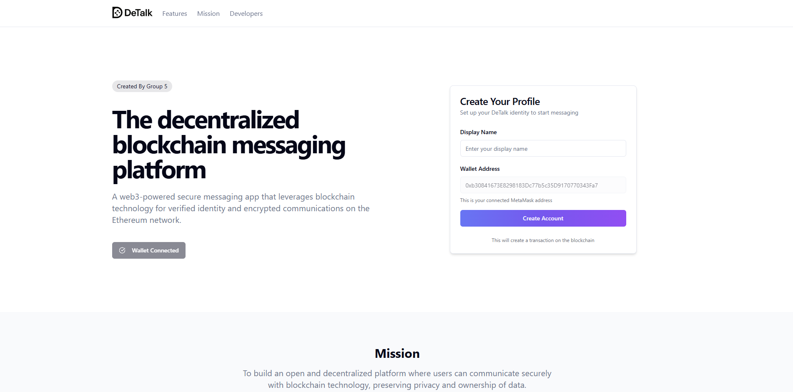
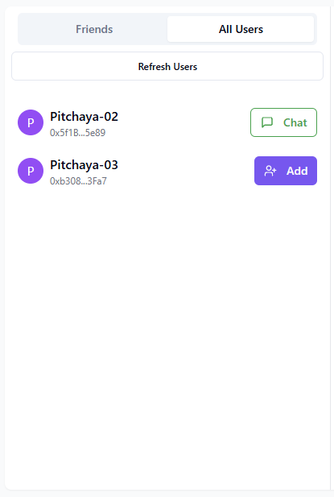
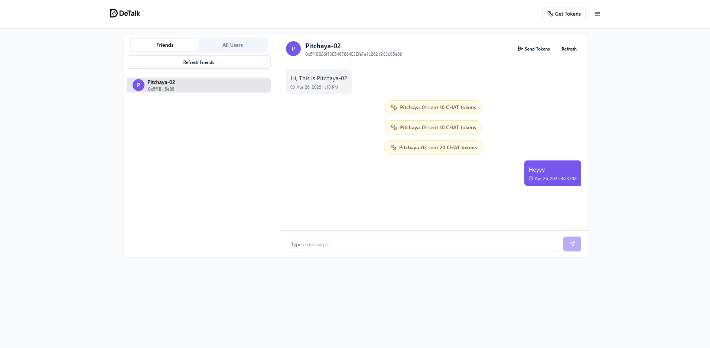
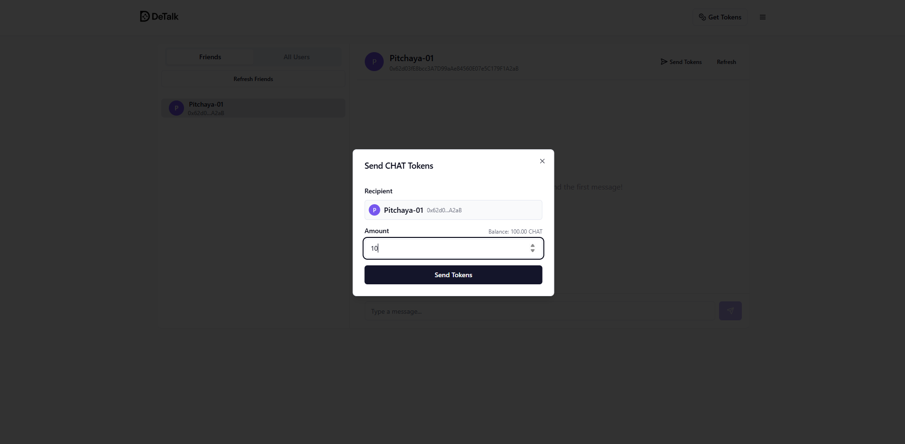
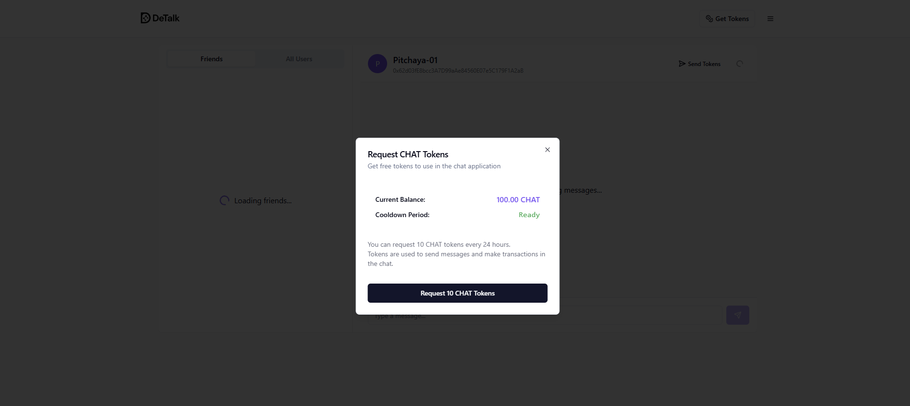
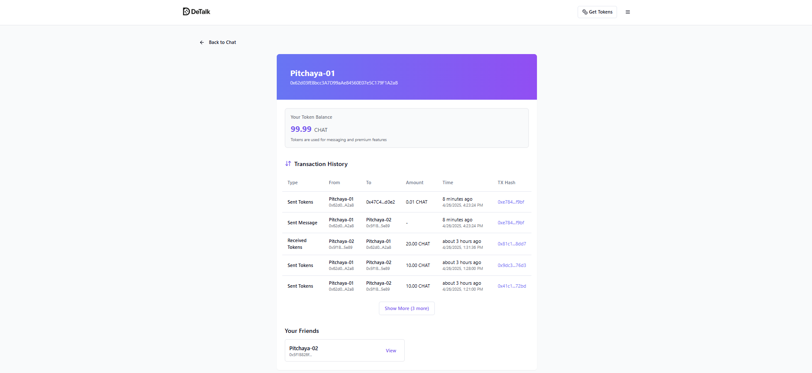

# DeTalk - แอปพลิเคชันแชทบนบล็อกเชน (DEMO เพื่อการศึกษา)

## ✨ สารบัญ

- [📄 ภาพรวมโปรเจค](#📄-ภาพรวมโปรเจค)
- [🛠️ เทคโนโลยีที่ใช้](#🛠️-เทคโนโลยที่ใช้)
- [⚙️ ทดลองใช้งาน](#⚙️-ทดลองใช้งาน)
- [🔹 ฟีเจอร์หลัก](#🔹-ฟีเจอร์หลัก)
- [🚀 Smart Contract](#🚀-smart-contract)

---
## 📄 สมาชิก

<table align="center">
  <tr>
    <td align="center">
       
      65051645 พิชยะ หุตะจูฑะ
    </td>
    <td align="center">
       
      65073814 พิชญาภา บุญถนอม
    </td>
    <td align="center">
       
      65054924 ปิยย์กฤษณ์ วงศ์เกษมศักดิ์
    </td>
  </tr>
</table>

---
## 📄 ภาพรวมโปรเจค

DeTalk คือแพลตฟอร์มแชทบนบล็อกเชนที่ให้ผู้ใช้สามารถลงทะเบียน เพิ่มเพื่อน แชท ส่งโทเคน และดูประวัติการทำธุรกรรมได้ โดยมีโทเคน $CHAT เป็นสื่อกลางในการใช้งานระบบ ซึ่งทุกข้อความจะถูกจัดเก็บอย่างถาวรและปลอดภัยผ่าน Smart Contract

## 🛠️ เทคโนโลยีที่ใช้

### Frontend:

- Vite + React + TypeScript
- Tailwind CSS + shadcn/ui
- TanStack Query

### Blockchain:

- Solidity
- Remix IDE
- Web3.js

## ⚙️ ทดลองใช้งาน

https://Podvossto.github.io/Detalk-App

> ⚡ ต้องติดตั้ง MetaMask และเชื่อมต่อเครือข่าย Holesky Testnet

## 🔹 ฟีเจอร์หลัก

### • ลงทะเบียนด้วย Wallet Address พร้อมรับโทเคนเริ่มต้น 100 $CHAT  

ตั้งชื่อและยืนยัน เมื่อ Transaction Success จะเข้าสู่ระบบอัตโนมัต

---

### • เพิ่มเพื่อน  

  

เห็น User ทุกคนที่อยู่ในระบบและสามารถแอดได้

---

### • แชทแบบส่วนตัว (0.01 $CHAT ต่อข้อความ)  

สามารถส่งข้อความหาคนที่เป็นเพื่อนเท่านั้น

สามารถส่ง TOKEN CHAT ให้เพื่อนได้

---

### • ขอโทเคนจากระบบ (จำกัด 10 $CHAT ต่อ 24 ชม.)  

กดรับ 10 CHAT TOKEN ทุกๆ 1 วัน

---

### • ดูโปรไฟล์ / ยอด TOKEN คงเหลือ / ประวัติธุรกรรมต่างๆ  

---

### • ธีม Dark / Light Mode  

---

## 🚀 Smart Contract

### ChatContract Address : 0x47C4bdBb0977D926b956e0D6735FB3e6aA49d0e2

Link : [https://holesky.etherscan.io/address/0x47C4bdBb0977D926b956e0D6735FB3e6aA49d0e2](https://holesky.etherscan.io/address/0x47C4bdBb0977D926b956e0D6735FB3e6aA49d0e2)

จัดการผู้ใช้ เพื่อน แชท และค่าธรรมเนียม:

- registerUser, getUserByAddress, getAllUsers
- addFriend, getFriends, checkFriendship
- sendMessage, getMessages
- sendTokensToFriend, withdrawTokens

### TokenContract : 0x2C6c792ED415d7360e783761a425FACaa2B4343C

Link : [https://holesky.etherscan.io/address/0x204dD20D690cfa5B12c063Df5a10B4Aa7f49090A](https://holesky.etherscan.io/address/0x2C6c792ED415d7360e783761a425FACaa2B4343C#code)

จัดการโทเคน $CHAT:

- transfer, approve, allowance
- mint, requestTokens
- getCooldownRemaining
